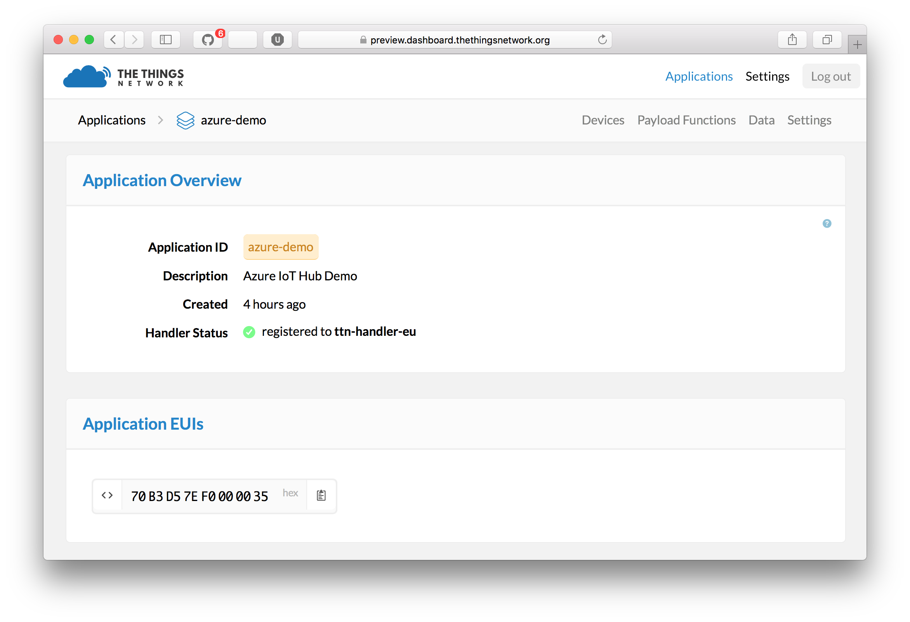
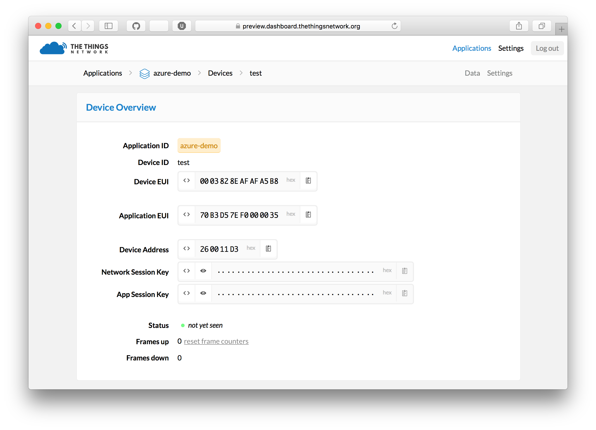
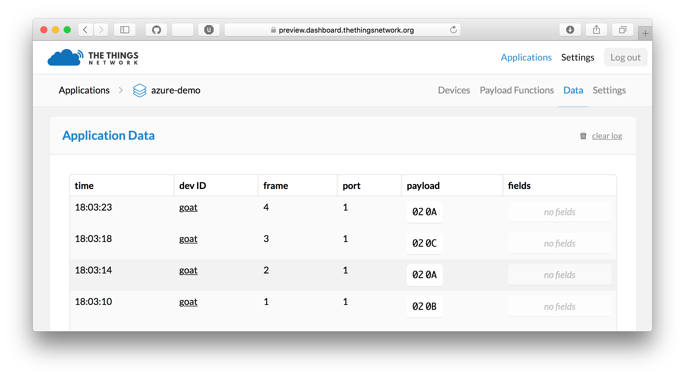
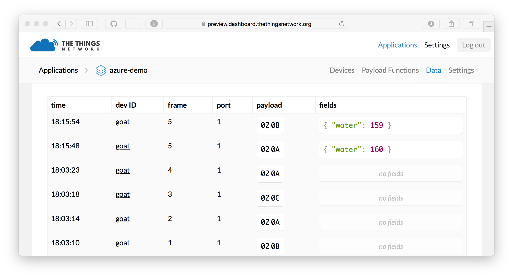

# The Things Uno Workshop

## Pre-requisites

1. The Things Uno
2. Micro-USB cable
3. Motion and water sensor
4. Laptop with Windows 7 or higher, Mac OS X or Linux

## Setup

1. Download and install [Arduino IDE](https://www.arduino.cc/en/Main/Software)
2. In Arduino IDE, go to **sketch** > **Include Library** > **Manage Library**, search for **TheThingsNetwork** and install the TheThingsNetwork's Arduino library.
3. Connect the The Things Uno to your computer using the Micro-USB cable
4. Select **Tools** > **Board** > **Arduino Leonardo**
5. Select **Tools** > **Port** > the port that identifies as **Arduino Leonardo**. For example, on Mac OS X:
   
   On Windows, in **Control Panel**, open the **Device Manager** to see which COM port you should use.

## Connect Sensors

Follow the instructions of the workshop facilitator to connect your sensors.

## Read sensors

Open the Arduino IDE and follow these steps.

1. Connect The Things Uno to your computer
2. Paste the following code in a new sketch:
```c
// Define the pins of your sensors
#define PIN_PIR 2
#define PIN_WATER A0

// Setup runs once
void setup() {
  pinMode(PIN_PIR, INPUT);
}

// Loops runs indefinitely
void loop() {
  // Read the sensors
  uint8_t motion = digitalRead(PIN_PIR);
  uint16_t water = analogRead(PIN_WATER);

  // Only print the water value when there is motion
  if (motion == HIGH) {
    Serial.print("Water: ");
    Serial.println(water);
  }

  // Wait one second
  delay(1000);
}
```
3. In the **Sketch** menu, click **Upload**
4. Once the sketch has been uploaded, go to the **Tools** menu and open the **Serial Monitor**
5. You should see output like this, only new lines when there is motion (your PIR sensor lights up red):
```
Water: 572
Water: 573 
...
```

## Create The Things Network application

Follow the steps to create an application and register your device.

1. Log into the [The Things Network dashboard](https://preview.dashboard.thethingsnetwork.org). You will be asked to provide TTN credentials if needed
2. Add a new application. Pick a unique Application ID
    
3. Go to **Manage devices** and click **Register device**
4. Enter a **Device ID** and click **Randomize** to use a random Device EUI
5. Click **Settings**
6. Check **Disable frame counter checks**
7. Click **Personalize device** and confirm by clicking **Personalize**
    
8. Keep this page open, you need the device address, network session key and application session key in a minute


## Send data from your device

In the Arduino IDE, create a new sketch and paste the following code.

```c
#include <TheThingsNetwork.h>

// Set your DevAddr
const byte devAddr[4] = { ... }; //for example: {0x02, 0xDE, 0xAE, 0x00};

// Set your NwkSKey and AppSKey
const byte nwkSKey[16] = { ... }; //for example: {0x2B, 0x7E, 0x15, 0x16, 0x28, 0xAE, 0xD2, 0xA6, 0xAB, 0xF7, 0x15, 0x88, 0x09, 0xCF, 0x4F, 0x3C};
const byte appSKey[16] = { ... }; //for example: {0x2B, 0x7E, 0x15, 0x16, 0x28, 0xAE, 0xD2, 0xA6, 0xAB, 0xF7, 0x15, 0x88, 0x09, 0xCF, 0x4F, 0x3C};

TheThingsNetwork ttn;

// Define the pins of your sensors
#define PIN_PIR 2
#define PIN_WATER A0

// Setup runs once
void setup() {
  // The PIR is a digital input
  pinMode(PIN_PIR, INPUT);

  Serial.begin(9600);
  Serial1.begin(57600);

  ttn.init(Serial1, Serial);
  ttn.reset();

  //the device will configure the LoRa module
  ttn.personalize(devAddr, nwkSKey, appSKey);

  ttn.showStatus();
  Serial.println("Setup for The Things Network complete");
}

// Loop runs indefinitely
void loop() {
  // Read sensors
  uint8_t motion = digitalRead(PIN_PIR);
  uint16_t water = analogRead(PIN_WATER);

  // Check if there is motion
  if (motion == HIGH) {
    // Print the water value
    Serial.print("Water: ");
    Serial.println(water);

    // Send data to The Things Network
    byte buffer[2];
    buffer[0] = highByte(water);
    buffer[1] = lowByte(water);
    ttn.sendBytes(buffer, sizeof(buffer));
  }

  // Wait 10 seconds
  delay(10000);
}
```

1. Insert your device address in `devAddr`, nework session key in `nwkSkey` and application session key in `appSKey`. You can use the handy `<>` button in the dashboard to copy it quickly as a C-style byte array; exactly what Arduino wants.
2. In the **Sketch** menu, click **Upload**
3. Open the **Serial Monitor** again from the **Tools** menu once upload has completed. Your device should now be sending data to The Things Network
4. In The Things Network dashboard, go to **Data**. You see packets coming in:
    
5. Now, binary payload is not really useful in upstream. Therefore, we have payload functions.
6. In the application overview, click **Payload Functions**
7. Add the following **decoder** function to decode the two bytes back to a 16 bit integer called `water`:
```c
function Decoder(bytes) {
  var water = (bytes[0] << 8) | bytes[1];
  return {
    water: water
  };
}
```
8. We want to invert the resistance of the water sensor, so that more water is a higher value. The maximum value of 3v3 analog ADC conersion is `682`, so use the following as the **converter**:
```
function Converter(decodedObj) {
  decodedObj.water = 682 - decodedObj.water;
  return decodedObj;
}
```
9. Go back to your data overview. Now you should see something like this:
    

Now we have clean data ready to be processed in Node-RED.


### Getting Your Data

In this tutorial, we're using Node-RED to get the data from The Things Network
routing services and push it to an application back-end.

1. In the dashboard, go to your application and scroll down. You'll need the `Application ID` and the `Access Key` as shown there in step 5 and 6
2. Install [Node.js](https://nodejs.org/en/), [Node-RED](http://nodered.org) and the Node-RED node: `npm install -g node-red-contrib-ttn@refactor`
3. From the **input** category in the toolbox on the left, drop a **TTN** node on your workflow
4. Double-click the node named `ttn` and click the pencil to add a new application
5. Enter as **App ID** your App EUI from the dashboard (see step 1)
6. Enter as **Access Key** your Access Key from the dashboard
7. Enter as **Region or Broker** the region `eu`
8. Click **Add**
9. From the **output** category, drop a new **debug** node on the flow and
    connect the *first output* of the **ttn** node to the input of the **debug**
    node.

Click **Deploy** and monitor the **debug** tab on the right for incoming messages. You will start
seeing messages like:

```
{ "water": 152 }
{ "water": 163 }
```


Node-RED allows you to build all kinds of flows with basic business logic. You can
add switches, triggers, custom functions and install thousands of nodes with
additional functionality, for example storing data in a database.

A common use case is to invoke a HTTP request to an external web service of your application.

To complete the end-to-end workshop, we're going to use If This Then That (IFTTT) to connect to APIs.

## Push to IFTTT

1. Go to [IFTTT](https://ifttt.com) and create an account
2. Go to [IFTTT Maker Channel](https://ifttt.com/maker)
3. Click **Connect**
4. Go to **Receive a web request**
5. Click **Create a new Recipe** and click **This** to configure the trigger
6. Choose **Maker** as the trigger channel
7. Click **Receive a web request** as the trigger
8. Enter an **Event Name**, for example `data`
9. Click **That** to configure an action, e.g. post a tweet on Twitter, e-mail or a notification to your phone
10. Use the fields `value1` and `value2` as ingredient, e.g. the tweet text could be `Hey, the water is {{value1}}! @thethingsntwrk`
11. Click **Create Action**
12. Click **Create Recipe**
13. Go back to Node-RED
14. Drop a new **Function** on the flow, double-click it and name it `Create request`
15. As the function body, return `value1` as JSON object:
```javascript
return {
    payload: {
        value1: msg.payload.water
    }
}
```
16. Drop a new **HTTP request** on the flow and connect it to the function
17. Select the **POST** method and enter the URL as seen on **How to Trigger Events** of the [IFTTT Maker Channel](https://ifttt.com/maker):


## OK. Done. What's Next?

Congratulations! You just learned how to create an account, an application,
register a device, send data from a device, decode it, get it in Node-RED,
process it and push it to IFTTT to connect to the world of APIs.

Now, Node-RED can be used to build complex applications too. You can store data
in a database, query data on an interval, add all kinds of business rules and
invoke any web service.

From this starting point, you can start building a real world application. Here are some useful links:

- Install Node-RED locally: install [Node.js](https://nodejs.org/en/), [Node-RED](http://nodered.org) and the [TTN node](https://github.com/TheThingsNetwork/sdk/tree/master/apps/node-RED)
- Installing custom functionality in Node-RED, see the [Node-RED Library](http://flows.nodered.org)
- Connect your application directly using MQTT. Pick a client for your favorite programming language from [Eclipse Paho](http://www.eclipse.org/paho/), and see The Things Network wiki on [how to connect MQTT](https://www.thethingsnetwork.org/wiki/Backend/Connect/Application) 
- Storing data in a time series database (e.g. [InfluxDB](https://influxdata.com) and get the [Node-RED node for InfluxDB](http://flows.nodered.org/node/node-red-contrib-influxdb))
- Interactive visualization of data in charts (e.g. [Grafana](http://grafana.org) works good with InfluxDB)
- Do-it-yourself charts and maps (e.g. use [Socket.io to get data](https://github.com/TheThingsNetwork/examples/tree/master/socketio)
  and visualize with [Flot](http://flotcharts.org) and [Google Maps API](https://developers.google.com/maps/))
- Control actuators by using downlink messages (see in Arduino IDE: **File** > **Examples** > **TheThingsUno** > **Downlink** example
  and the [wiki](http://thethingsnetwork.org/wiki/Backend/Connect/Application) about sending downlink messages from an application)
- Integrate with internet of things cloud platforms (see [Azure IoT Hub](https://github.com/TheThingsNetwork/examples/tree/master/integrations/azure) and [AWS IoT](https://github.com/TheThingsNetwork/examples/tree/master/integrations/aws) example integrations)


[accounts]:  https://account.thethingsnetwork.org
[dashboard]: https://staging.thethingsnetwork.org
